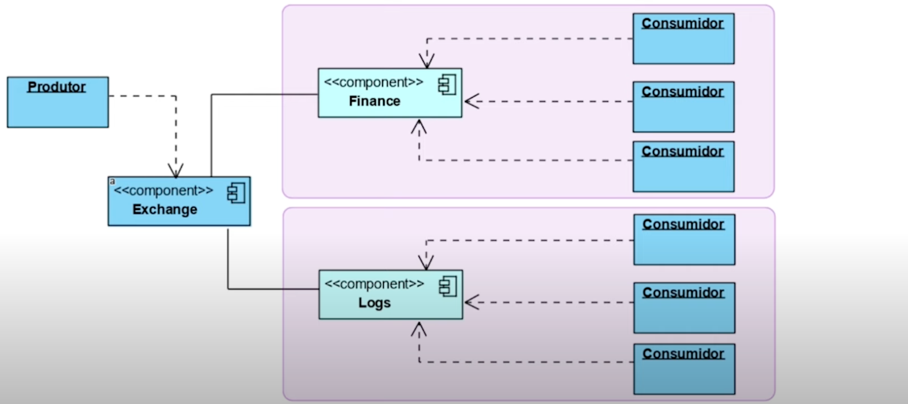
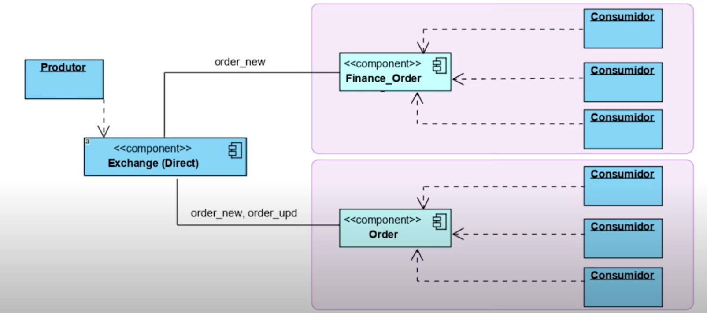

# Exchanges

A exchange é basicamente um sistema de roatementos.
Quando a exchang é utilizada, o produtor bate na exchange, e não na fila.
Quando não é especificado algum tipo de exchange, é utilizada a exchange default do RabbitMQ.

## Fanout

Utilizado quando preciso fazer cópias da mesma mensagem para mais de uma fila. (réplica)

O tipo de exchange 'fanout' ignora o parâmetro 'routingKey'.

## Direct

Só irá rotear a mensagem para a fila se ela possuir a mesma chave de rota (routingKey)

